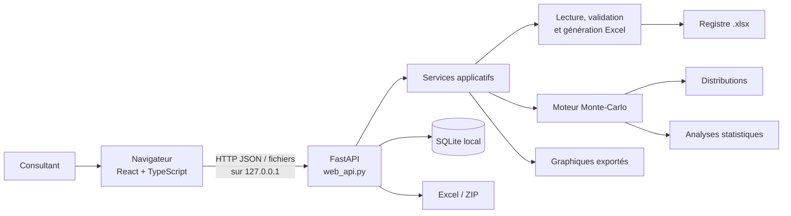
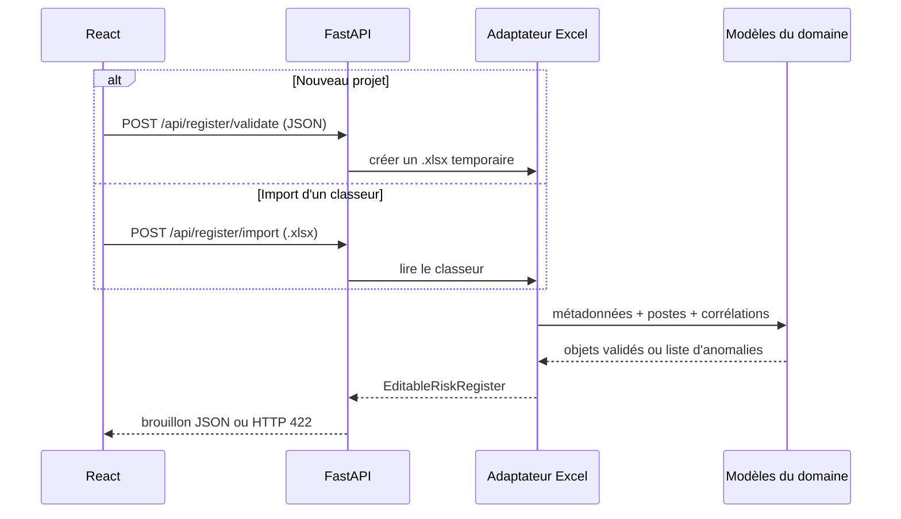
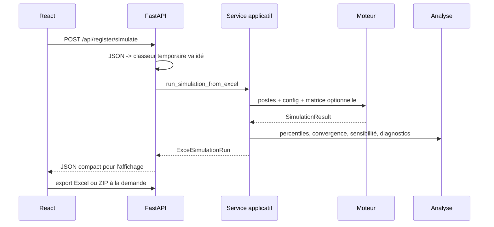
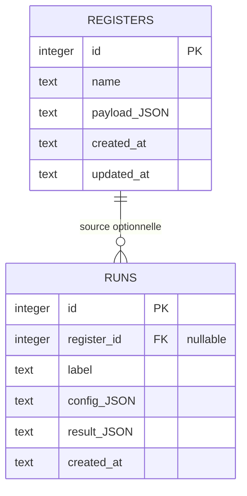

# Architecture technique de RiskSim — Monte Carlo

Ce document décrit l'architecture **réellement implémentée** dans le dépôt. Il s'adresse aux
développeurs, mainteneurs et responsables techniques qui doivent comprendre les frontières entre
l'interface, l'API, le moteur de calcul, les fichiers Excel et la persistance locale.

Pour une présentation fonctionnelle plus accessible, voir
[`project_overview.md`](project_overview.md). Pour les choix mathématiques, voir
[`methodology.md`](methodology.md).

## 1. Synthèse de l'architecture

RiskSim est une application monoposte composée de deux ensembles :

- une interface React/TypeScript, exécutée dans le navigateur ;
- un processus Python local qui sert l'interface, expose l'API FastAPI, exécute le moteur
  Monte-Carlo, produit les exports et accède à SQLite.

En production, ces ensembles sont distribués dans **un seul exécutable Windows**. L'utilisateur
n'installe ni serveur distant ni base de données séparée. Le lanceur démarre Uvicorn sur
`127.0.0.1`, choisit un port disponible et ouvre le navigateur par défaut.



Cette organisation repose sur quatre décisions structurantes :

1. **Le navigateur ne calcule pas la simulation.** Il édite les données et affiche les résultats.
2. **L'API ne réimplémente pas les règles probabilistes.** Elle adapte HTTP au service Python.
3. **Le moteur ne connaît ni Excel, ni HTTP, ni React.** Il reçoit des modèles validés.
4. **L'installation est locale par conception.** Le serveur n'écoute jamais sur le réseau.

## 2. Organisation du dépôt

```text
Monte-Carlo-Simulator/
├── src/monte_carlo_simulator/
│   ├── models/           modèles du domaine et invariants
│   ├── distributions/    lois probabilistes et fabrique
│   ├── engine/           génération vectorisée et corrélations
│   ├── analysis/         statistiques et diagnostics
│   ├── io/               contrat Excel, validation et exports
│   ├── visualization/    graphiques Matplotlib exportables
│   ├── application/      orchestration des cas d'utilisation
│   ├── storage/          persistance SQLite locale
│   ├── web_api.py        adaptateur HTTP FastAPI
│   ├── launcher.py       démarrage local et ouverture du navigateur
│   ├── resources.py      résolution des ressources source/PyInstaller
│   └── cli.py            interface en ligne de commande
├── web/                  application React + TypeScript + Vite
├── data/templates/       modèle public du registre Excel
├── packaging/            spécification PyInstaller
├── tests/                tests Python unitaires et d'intégration
├── scripts/              cas d'acceptation et génération de rapports
├── docs/                 guides, références et preuves de validation
└── .github/workflows/     qualité et construction de l'exécutable
```

Les dépendances doivent aller de l'extérieur vers le cœur :

```text
React -> FastAPI -> application -> io / engine / analysis / visualization
                                  -> models <- distributions
FastAPI -> storage
launcher -> FastAPI
```

Une règle probabiliste ajoutée dans un composant React ou directement dans une route FastAPI
constituerait donc une rupture d'architecture.

## 3. Cycle d'exécution

### 3.1 Développement

Deux processus sont utilisés :

- Vite sert React sur `localhost:5173` ;
- Uvicorn sert l'API Python sur `127.0.0.1:8000`.

Le proxy défini dans `web/vite.config.ts` relaie `/api` vers le port 8000. CORS n'autorise que
`http://localhost:5173` et `http://127.0.0.1:5173`, ce qui correspond à ce scénario.

### 3.2 Version construite ou exécutable

Vite produit `web/dist`. `web_api.py` monte ce répertoire en dernier sur `/`, après toutes les
routes `/api`. La classe `SinglePageFiles` renvoie `index.html` lorsqu'une route React telle que
`/risques` ou `/resultats` est ouverte directement. Une route API inconnue conserve en revanche
un vrai statut 404.

`launcher.py` :

1. lit le port souhaité (`8000` par défaut ou `MCS_PORT`) ;
2. cherche le premier port libre parmi vingt ports consécutifs ;
3. conserve l'adresse d'écoute fixe `127.0.0.1` ;
4. démarre en arrière-plan une sonde de `/api/health` ;
5. démarre Uvicorn sans rechargement automatique ;
6. ouvre le navigateur uniquement lorsque l'API répond, sauf avec `--no-browser`.

`resources.py` masque la différence entre les ressources du dépôt et celles extraites par
PyInstaller dans `sys._MEIPASS`. Le code utilise ainsi le même chemin logique pour `web/dist` et
`data/templates`, qu'il soit lancé depuis les sources ou depuis l'exécutable.

## 4. Interface React

### 4.1 Initialisation et routage

`web/src/main.tsx` installe, dans cet ordre :

- `BrowserRouter` pour la navigation ;
- `ThemeProvider` pour le mode clair, sombre ou système ;
- `SimulationProvider` pour l'espace de travail courant ;
- `App`, qui déclare les routes sous la coque commune `AppShell`.

Routes principales :

| Route | Responsabilité |
| --- | --- |
| `/` | tableau de bord local |
| `/risques` | création/import du projet, postes, corrélations, validation, registres enregistrés |
| `/configuration` | paramètres d'exécution et scénarios |
| `/resultats` | synthèse, distribution, sensibilité, robustesse et exports |
| `/comparaison` | comparaison d'un résultat courant avec une référence gelée |
| `/scenarios` | redirection de compatibilité vers l'onglet Scénarios de `/configuration` |
| `/parametres` | préférences de l'interface et informations de stockage |
| `/aide` | aide embarquée et glossaire |

`AppShell` porte la mise en page, la navigation latérale rétractable et le point d'ouverture dans
la zone principale. Les feuilles `tokens.css`, `global.css`, `workspace.css` et
`enhancements.css` séparent respectivement les variables visuelles, les styles généraux, les vues
métier et les améliorations récentes.

### 4.2 État côté navigateur

`SimulationContext.tsx` est le modèle d'état partagé de l'interface. Il conserve :

- le brouillon du registre ;
- la source du projet (`new`, `imported` ou aucune) ;
- la configuration de simulation ;
- les scénarios enregistrés dans l'espace de travail ;
- la copie du registre importé permettant d'annuler les modifications ;
- l'identifiant du registre SQLite associé ;
- le dernier résultat et la référence de comparaison.

La persistance côté navigateur est volontairement répartie :

| Stockage | Contenu | Durée |
| --- | --- | --- |
| `localStorage` | espace de travail, scénarios, référence, thème, état du panneau | jusqu'à effacement des données du navigateur |
| `sessionStorage` | dernier résultat affiché | durée de la session de l'onglet |
| SQLite | registres publiés et exécutions conservées | durable sur le poste |

Les scénarios de travail dans `localStorage` ne remplacent donc pas l'enregistrement durable.
Pour qu'une décision soit traçable après nettoyage du navigateur, le registre doit être enregistré
et l'exécution doit être conservée dans l'historique SQLite.

### 4.3 Adaptateurs HTTP

L'interface centralise ses appels dans :

- `services/simulationService.ts` : import, validation, export de registre, simulation et exports
  de résultats ;
- `services/savedProjects.ts` : registres, exécutions et informations de stockage ;
- `services/simulationMetrics.ts` : lecture et formatage de valeurs déjà calculées.

Les graphiques interactifs de `components/charts/LiveCharts.tsx` utilisent les tableaux renvoyés
par l'API et produisent du SVG. `Charts.tsx` contient encore d'anciens composants de démonstration,
mais aucune page routée ne les importe actuellement. Le parcours principal dépend exclusivement des
résultats réels de `LiveCharts.tsx`.

## 5. Adaptateur HTTP FastAPI

`src/monte_carlo_simulator/web_api.py` traduit les contrats web en objets Python. Les modèles
Pydantic décrivent le projet, les postes, les corrélations et la configuration. Les noms JSON en
camelCase sont convertis vers les noms attendus par le schéma Excel et le domaine Python.

### 5.1 Routes exposées

| Méthode et route | Usage |
| --- | --- |
| `GET /api/health` | vérifier que le moteur local répond |
| `GET /api/template` | télécharger le modèle Excel public |
| `POST /api/register/import` | importer et convertir un `.xlsx` en brouillon éditable |
| `POST /api/register/validate` | générer temporairement le classeur et appliquer la validation Python |
| `POST /api/register/export` | exporter le brouillon validé au format `.xlsx` |
| `POST /api/register/simulate` | valider puis simuler le brouillon JSON courant |
| `POST /api/simulate` | simuler directement un classeur `.xlsx` envoyé en multipart |
| `POST /api/results/export` | créer le classeur Excel des résultats |
| `POST /api/results/export-bundle` | créer le ZIP contenant registre, résultats et graphiques |
| `GET/POST /api/registers` | lister ou enregistrer un registre dans SQLite |
| `GET/DELETE /api/registers/{id}` | lire ou supprimer un registre |
| `GET/POST /api/runs` | lister ou conserver une exécution |
| `GET /api/storage` | donner le chemin SQLite et les compteurs locaux |

Les fichiers importés doivent porter l'extension `.xlsx` et sont limités à 12 Mio. Les traitements
intermédiaires utilisent `TemporaryDirectory` : le classeur reçu et les artefacts transitoires sont
supprimés à la fin de la requête. Seuls un téléchargement renvoyé au navigateur ou un enregistrement
explicite en SQLite devient durable.

Les erreurs métier `ValidationError` et `RiskRegisterValidationError` sont renvoyées en HTTP 422.
Une extension non admise donne 415, un fichier trop volumineux 413 et une ressource absente 404.

### 5.2 Forme de la réponse de simulation

La fonction `_payload` transforme `ExcelSimulationRun` en un objet JSON contenant :

- `project` : identité, type d'analyse, unité et référence ;
- `run` : nombre de tirages, graine, niveaux, corrélations et date ;
- `summary` et `percentiles` ;
- `sensitivity`, `convergence`, `baselineComparison`, `correlationDiagnostics` ;
- `histogram` : 34 classes calculées à partir des tirages ;
- `sCurve` : jusqu'à 150 points ordonnés pour l'affichage interactif.

Les tirages individuels ne sont pas transmis au navigateur. Cela réduit le volume de la réponse et
empêche l'interface de devenir dépendante du format interne NumPy/Pandas.

La configuration web contient aussi des champs de gouvernance. Leur portée actuelle doit être
distinguée de celle du moteur :

| Champ | Effet actuel |
| --- | --- |
| `simulations` | transmis à `SimulationConfig` et utilisé par le moteur |
| `seed` | transmis à `SimulationConfig` et utilisé par le générateur NumPy |
| `levels` | transmis à `SimulationConfig`, utilisé pour les percentiles et le niveau de convergence surveillé |
| `decisionPercentile` | choisit le percentile mis en évidence par React ; n'altère pas les tirages |
| `exceedanceThreshold` | conservé dans le scénario et l'export ; la probabilité affichée est actuellement calculée par rapport à `baselineEstimate` |
| `convergenceTolerance` | conservé dans le scénario et l'export ; le service Python utilise actuellement la tolérance par défaut de 1 % |
| `samplingMethod` | fixé à `pseudo-random` dans React et non transmis au moteur |
| nom/description du scénario | documentation et traçabilité, sans effet numérique |

Ce tableau évite d'attribuer au calcul des réglages qui ne sont pas encore câblés jusqu'au service
Python.

## 6. Cœur Python

### 6.1 `models` — objets du domaine

Les modèles imposent les invariants avant le calcul :

- `RiskItem` normalise le nom d'une loi, vérifie ses paramètres et porte catégorie, unité et notes ;
- `SimulationConfig` valide le nombre de tirages, la graine et les niveaux de confiance ;
- `CorrelationMatrix` vérifie noms, dimensions, coefficients, diagonale, symétrie et définition
  positive stricte ;
- `RiskRegisterMetadata` et `RiskRegister` regroupent le contexte et les postes validés ;
- `SimulationResult` conserve le total, le résumé et les échantillons par poste ;
- `ExcelSimulationRun` référence le résultat et les artefacts produits.

Ces classes ne connaissent pas HTTP et ne pilotent pas de fichiers utilisateur.

### 6.2 `distributions` — lois probabilistes

Six lois sont prises en charge : triangulaire, Beta-PERT, uniforme, normale, lognormale et risque
événementiel Bernoulli × impact. `factory.py` associe le nom canonique à un constructeur, ce qui
évite une chaîne de conditions dans le moteur.

Chaque loi respecte `BaseDistribution.sample(rng, size)` et génère un vecteur NumPy complet. Pour
le calcul corrélé, les lois exposent également une fonction quantile `ppf` utilisée par la copule.
Les paramètres sont contrôlés dans les modèles et dans les classes de distribution.

### 6.3 `engine` — génération et agrégation

`MonteCarloSimulator.run` réalise le calcul :

1. vérifie la présence et l'unicité des noms de postes ;
2. crée un unique `numpy.random.Generator` avec `numpy.random.default_rng(seed)` ;
3. génère un vecteur de longueur `N` pour chaque poste ;
4. construit une table `item_samples` de forme `N × nombre_de_postes` ;
5. somme les colonnes ligne par ligne ;
6. calcule les statistiques demandées ;
7. renvoie un `SimulationResult`.

Le moteur boucle sur les postes, jamais sur les tirages individuels : la génération et la somme
sont vectorisées avec NumPy/Pandas. À code, versions de bibliothèques, données, configuration et
graine identiques, le générateur suit la même suite pseudo-aléatoire, ce qui rend le calcul
reproductible.

Les valeurs métier ne sont pas standardisées ni ramenées artificiellement entre 0 et 1 avant
l'agrégation. Elles doivent être exprimées dans une unité commune cohérente. Les transformations
mathématiques nécessaires à une loi, par exemple la conversion des moments arithmétiques d'une
lognormale, restent internes à cette loi et ne changent pas le sens des entrées du consultant.

### 6.4 Corrélations

Lorsque la matrice est fournie :

1. elle est réalignée sur l'ordre des postes actifs ;
2. Cholesky produit la transformation de dépendance ;
3. le moteur génère des normales standard corrélées ;
4. la fonction de répartition normale les convertit en probabilités uniformes ;
5. chaque `ppf` transforme sa colonne vers la loi marginale du poste ;
6. les colonnes sont agrégées comme dans le cas indépendant.

La politique est **strict-no-repair**. Une matrice non carrée, non symétrique, mal alignée, hors
`[-1, 1]` ou non strictement définie positive est rejetée. Le moteur ne modifie jamais en silence
la matrice fournie. Un poste déterministe ne peut pas porter de corrélation non nulle avec un autre
poste.

### 6.5 `analysis` — résultats de décision

Cette couche produit notamment :

- moyenne, écart-type, minimum, maximum et percentiles ;
- table de décision et réserve positive par rapport à la référence ;
- probabilité de dépassement de la référence ;
- sensibilité de Spearman et données du diagramme tornado ;
- convergence cumulative du percentile surveillé ;
- diagnostics numériques de la matrice de corrélation.

Le diagnostic de convergence observe le percentile par blocs cumulatifs. Le service choisit un bloc
compris entre 1 et 1 000 tirages, avec environ dix blocs pour les petits calculs. Le résultat indique
la variation relative et un éventuel point de stabilité ; il ne prétend pas valider les hypothèses
métier.

### 6.6 `application` — orchestration

`run_simulation_from_excel` est le cas d'utilisation central. Il :

1. charge et valide le registre ;
2. exécute `MonteCarloSimulator` ;
3. génère résumé, histogramme et S-curve ;
4. calcule percentiles, convergence, sensibilité et tornado ;
5. ajoute la comparaison à la référence si elle existe ;
6. ajoute les diagnostics de corrélation si une matrice existe ;
7. renvoie un `ExcelSimulationRun` qui référence tous les artefacts.

`application/hypotheses.py` adapte un classeur validé vers une table modifiable par l'interface,
y compris les lignes désactivées, tout en conservant la matrice de corrélation.

### 6.7 `io` et `visualization`

`io` contient le contrat Excel versionné, la lecture OpenPyXL, la conversion en modèles, la
validation agrégée et les exports. Les erreurs de registre conservent autant que possible la feuille,
la ligne Excel, le poste, le champ et la valeur fautive.

`visualization` génère les images Matplotlib destinées aux artefacts : histogramme, S-curve et
tornado. L'interface web dessine parallèlement ses vues interactives à partir du JSON ; elle ne lit
pas les images Matplotlib pour afficher les résultats à l'écran.

## 7. Flux Excel

### 7.1 Contrat du registre 1.0

Feuilles obligatoires :

- `metadata` : version, projet, type `cost`/`duration`, unité, référence et description ;
- `risk_register` : postes, lois, paramètres, catégorie, unité, activation et notes ;
- `instructions` : règles d'utilisation intégrées au classeur.

Feuille optionnelle :

- `correlations` : matrice carrée alignée sur les noms des postes actifs.

Le lecteur extrait d'abord les cellules et les numéros de lignes, puis agrège les anomalies au lieu
de s'arrêter à la première. Les lignes désactivées restent éditables mais ne sont pas converties en
postes actifs pour la simulation.

### 7.2 Création et import depuis React



Le passage temporaire par Excel pendant la validation d'un brouillon garantit que le constructeur
web et le fichier exporté appliquent le même contrat. Il évite deux validateurs divergents.

### 7.3 Simulation et exports



Le classeur de résultats comprend les feuilles `Synthèse`, `Percentiles`, `Sensibilité`,
`Convergence`, `Hypothèses` et `Robustesse`. Les images ne sont pas incorporées dans ce classeur :
elles sont livrées séparément dans le dossier ZIP, qui contient :

- `LISEZ_MOI.txt` ;
- `registre_risques_utilise.xlsx` ;
- `resultats_monte_carlo.xlsx` ;
- `donnees/resultats.json`, réponse complète du moteur ;
- quatre graphiques PNG : histogramme, S-curve, sensibilité et convergence.

## 8. Persistance SQLite

`storage/database.py` crée une base de schéma version 3 avec deux tables métier :



Points importants :

- les payloads sont enregistrés en JSON UTF-8 dans SQLite ;
- une connexion est ouverte par requête FastAPI puis toujours fermée ;
- les clés étrangères sont activées à chaque connexion ;
- le mode WAL autorise les lectures pendant une écriture ;
- un délai d'attente de 5 secondes absorbe les verrous courts ;
- supprimer un registre applique `ON DELETE SET NULL` aux exécutions ;
- aucune route ne supprime une exécution conservée ;
- les migrations retirent les anciennes tables d'utilisateurs et de sessions tout en préservant
  les registres et l'historique existants.

Emplacement par défaut sous Windows :

```text
%LOCALAPPDATA%\MonteCarloSimulator\monte_carlo.sqlite3
```

Sous Linux :

```text
${XDG_DATA_HOME:-~/.local/share}/MonteCarloSimulator/monte_carlo.sqlite3
```

`MCS_DATA_DIR` permet de déplacer cette base, notamment pour les tests ou une politique de
sauvegarde particulière.

## 9. Sécurité et confidentialité locales

Le modèle de sécurité est celui d'un outil monoposte :

- adresse d'écoute imposée à `127.0.0.1` ;
- aucune option de liaison à `0.0.0.0` ;
- aucun compte ni écran de connexion ;
- aucun envoi vers un service externe dans le parcours de simulation ;
- CORS limité au serveur Vite de développement ;
- limite de 12 Mio et contrôle de l'extension pour les imports web.

Ce choix réduit fortement l'exposition réseau, mais **ne chiffre pas les données au repos**. Toute
personne ayant accès à la session Windows et au fichier SQLite peut lire les données. La protection
réelle repose sur les droits du système, le chiffrement complet du disque et la sauvegarde maîtrisée
du répertoire de données.

Il ne faut jamais placer un registre client réel, la base SQLite ou un export confidentiel dans Git.
Un passage à une architecture réseau nécessiterait une nouvelle conception : authentification,
autorisation, TLS, gestion des secrets, journalisation et politique de conservation.

## 10. Construction de l'exécutable

`packaging/monte-carlo-simulator.spec` utilise PyInstaller en mode fichier unique. Il embarque :

- l'interpréteur et les dépendances Python ;
- les sous-modules Uvicorn chargés dynamiquement ;
- le build statique `web/dist` ;
- les modèles présents dans `data/templates`.

Les backends graphiques interactifs Matplotlib et les boîtes à outils GUI inutiles sont exclus.
L'exécutable utilise le sous-système graphique Windows (`console=False`) : aucun terminal n'apparaît
au lancement. La journalisation console d'Uvicorn est également désactivée dans la version figée.
Le navigateur n'est ouvert qu'après une réponse positive de `/api/health`, afin d'éviter d'afficher
une erreur de connexion pendant l'extraction et l'initialisation du fichier unique PyInstaller.

La chaîne de construction correcte est :

```text
npm ci / npm run build
        -> web/dist
installation Python [web, packaging]
        -> PyInstaller + monte-carlo-simulator.spec
        -> dist/MonteCarloSimulator.exe
        -> smoke test /api/health et routes React
```

Le workflow `.github/workflows/executable.yml`, lancé manuellement ou par tag `v*`, construit sous
Windows, démarre le binaire sur un répertoire de données temporaire, teste `/api/health`, `/`,
`/risques` et `/resultats`, puis publie l'exécutable comme artefact GitHub Actions.

## 11. Qualité et stratégie de test

### 11.1 Python

Le dossier `tests/unit` vérifie isolément les modèles, distributions, corrélations, statistiques,
convergence, sensibilité, Excel, stockage, API et lanceur. `tests/integration` couvre les chaînes
Excel et les cas de bout en bout, notamment le scénario corrélé reproductible.

Les contrôles CI sont :

- `ruff check .` ;
- `ruff format --check .` ;
- `pytest` avec couverture minimale de 85 % sur le package ;
- `mypy src/monte_carlo_simulator`.

Les workflows testent Python 3.11 et 3.12 ; le workflow `quality` exécute également la pile sur la
branche principale et les pull requests.

### 11.2 React

Vitest, Testing Library et jsdom couvrent les pages et composants clés : coque de l'application,
tableau de bord, registre, configuration et résultats. `npm run build` ajoute le contrôle TypeScript
`tsc -b` avant la construction Vite. Les tests frontend doivent vérifier les états vides, les
transitions guidées, les appels de service et la présence de données réelles dans les graphiques.

### 11.3 Niveaux de preuve

Les tests logiciels prouvent que le code respecte ses contrats et invariants numériques. Ils ne
prouvent pas qu'une hypothèse fournie par un consultant décrit correctement un projet réel. Cette
validation métier exige revue des sources, calibration, atelier avec les spécialistes et analyse de
sensibilité.

## 12. Limites actuelles

- La méthode d'échantillonnage disponible est pseudo-aléatoire ; Latin Hypercube est seulement
  annoncé comme extension future dans l'interface.
- Le seuil de dépassement saisi dans la configuration est documenté et exporté, mais le calcul de
  dépassement utilise actuellement la référence du projet (`baselineEstimate`).
- La tolérance de convergence sélectionnée est documentée et exportée, mais le service applique
  actuellement sa tolérance interne de 1 %. Le câblage de ces deux champs jusqu'à `analysis` reste
  un point d'extension.
- L'application ne réalise pas de calibration automatique à partir de projets historiques.
- La sensibilité de Spearman mesure une influence monotone, pas une causalité.
- Le diagnostic de convergence est un indicateur de stabilité numérique, pas une garantie métier.
- La dépendance définie dans la copule gaussienne ne signifie pas que la corrélation linéaire finale
  des marginales non normales sera exactement égale à chaque coefficient d'entrée.
- Les scénarios conservés uniquement dans le navigateur restent vulnérables à l'effacement du
  stockage web ; SQLite est requis pour l'archivage durable des décisions.
- Il n'existe pas d'authentification : cette architecture ne doit pas être exposée au réseau.
- Les anciens graphiques de démonstration non référencés dans `Charts.tsx` constituent une dette de
  nettoyage ; ils ne doivent pas être reconnectés à une page de résultats réels.

## 13. Points d'extension

| Besoin | Point d'entrée conseillé | Précaution |
| --- | --- | --- |
| Ajouter une loi | nouvelle classe dans `distributions`, puis fabrique | implémenter `sample` et `ppf`, valider les domaines, tester indépendant et corrélé |
| Ajouter un indicateur | module pur dans `analysis` | ne pas dépendre de FastAPI ou de React |
| Ajouter un artefact | orchestration dans `application/service.py`, export dans `io` ou `visualization` | conserver `ExcelSimulationRun` cohérent |
| Faire évoluer Excel | nouvelle version dans `io/schema.py` | migration explicite, compatibilité et tests de classeurs |
| Ajouter une route | `web_api.py` et service TypeScript associé | utiliser les modèles métier existants, traduire les erreurs attendues |
| Ajouter une page | route dans `web/src/App.tsx` | réutiliser les contextes et centraliser les appels dans `services` |
| Étendre SQLite | migration incrémentale dans `storage/database.py` | préserver l'historique et tester une base ancienne |
| Ajouter LHS/Sobol | abstraction d'échantillonnage dans le moteur | préserver la reproductibilité et la copule corrélée |
| Déployer en réseau | nouvelle couche d'identité et d'autorisation | ne jamais simplement changer `HOST` |

## 14. Invariants à préserver

Une évolution est compatible avec l'architecture si elle conserve au minimum les règles suivantes :

1. toutes les données sont validées avant simulation ;
2. les mêmes données, options et graine reproduisent le même calcul dans un environnement maîtrisé ;
3. aucune matrice de corrélation invalide n'est réparée silencieusement ;
4. la référence n'est jamais ajoutée implicitement au total simulé ;
5. les lois et analyses ne dépendent pas de l'interface ;
6. React ne recalcule pas les métriques probabilistes ;
7. supprimer un registre n'efface pas une exécution conservée ;
8. les erreurs de saisie sont explicites et localisables ;
9. l'exécutable continue de servir l'API et les routes profondes de l'interface ;
10. l'application sans authentification reste limitée à `127.0.0.1`.
