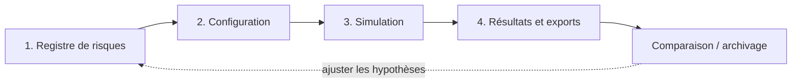

# Vue d'ensemble du projet RiskSim — Monte Carlo

## 1. Finalité

RiskSim est un outil d'aide à la décision pour l'analyse probabiliste des coûts et des durées de
projet. Il transforme les incertitudes décrites par le consultant en une distribution de résultats
possibles. L'objectif n'est pas de prédire une valeur certaine, mais d'aider à répondre à des
questions comme :

- quelle valeur a 80 % ou 90 % de chances de ne pas être dépassée ?
- quelle réserve faut-il prévoir par rapport à l'estimation de référence ?
- quels postes expliquent le plus la dispersion du résultat ?
- le nombre de tirages choisi donne-t-il une estimation suffisamment stable ?
- comment un scénario de mitigation se compare-t-il au scénario de référence ?

L'application traite un projet en **coût** ou en **durée**. Tous les postes agrégés doivent donc
être exprimés dans une unité compatible : par exemple EUR, MAD, jours ou semaines.

## 2. Positionnement dans le domaine

Le projet appartient au domaine de la **quantitative risk analysis** appliquée au pilotage de
projet. Il combine :

- la structuration d'un registre de risques ou de postes incertains ;
- la modélisation de chaque poste par une loi de probabilité ;
- la prise en compte optionnelle des dépendances entre postes ;
- la simulation Monte-Carlo ;
- la restitution d'indicateurs de décision et de robustesse ;
- la traçabilité des hypothèses, configurations et résultats.

RiskSim ne remplace ni l'expertise du consultant ni la qualité des données sources. Un moteur peut
être parfaitement reproductible tout en donnant un résultat trompeur si les bornes, probabilités,
corrélations ou unités sont mal choisies.

## 3. Parcours utilisateur

Le parcours principal suit quatre étapes logiques.



### 3.1 Préparer le registre

Dans la section **Registre de risques**, l'utilisateur peut :

- créer un nouveau projet ou importer un classeur Excel compatible ;
- renseigner le nom, le type d'analyse, l'unité, la référence et la description ;
- ajouter, modifier, désactiver ou supprimer les postes ;
- choisir une loi et saisir ses paramètres ;
- déclarer l'indépendance ou saisir une matrice de corrélation ;
- valider l'ensemble ;
- télécharger le registre `.xlsx` ;
- enregistrer le registre dans la base locale et le rouvrir plus tard.

Les cinq sous-sections — Projet, Postes, Corrélations, Validation et Enregistrés — suivent cet ordre
afin de rendre visibles les prérequis. Les boutons qui mènent à l'étape suivante restent désactivés
tant que les données indispensables ne sont pas validées, avec une indication vers l'étape à
corriger.

### 3.2 Configurer la simulation

La section **Simulation** regroupe la configuration d'exécution et la documentation du scénario :

- nombre de tirages ;
- graine pseudo-aléatoire ;
- niveaux de confiance à produire ;
- percentile de décision ;
- seuil de dépassement à documenter ;
- tolérance de convergence à documenter ;
- nom et description du scénario.

Dans l'implémentation actuelle, seuls le nombre de tirages, la graine et les niveaux sont transmis au
moteur. Le percentile de décision pilote l'affichage. Le seuil et la tolérance restent enregistrés
dans le scénario et l'export, mais la comparaison utilise la référence du projet et le calcul de
convergence la tolérance Python par défaut de 1 %. Leur raccordement complet est une évolution à
prévoir.

Un scénario conserve une copie du registre et de ces paramètres dans le navigateur. Il facilite les
essais « référence », « mitigation » ou « stress ». Pour un archivage durable et sauvegardable, il
faut toutefois enregistrer le registre et conserver l'exécution dans l'historique local.

### 3.3 Lancer le calcul

Au lancement, l'interface transmet le brouillon et la configuration à l'API locale. L'API construit
un registre Excel temporaire, lui applique exactement les mêmes contrôles qu'à un fichier importé,
puis appelle le moteur Python.

Le moteur génère un vecteur de tirages par poste. En cas d'indépendance, chaque loi reçoit ses
tirages du même générateur NumPy. En cas de dépendance, une copule gaussienne produit d'abord des
probabilités corrélées, ensuite converties vers les lois marginales. Le total d'une simulation est
la somme des valeurs de tous les postes actifs sur la même ligne.

### 3.4 Analyser et exporter

La section **Résultats** est divisée en quatre vues pour limiter le défilement :

- **Synthèse** : moyenne, percentiles, probabilité de dépassement, référence et réserve ;
- **Distribution** : histogramme interactif et courbe cumulative empirique ;
- **Sensibilité** : tornado et classement de Spearman ;
- **Robustesse** : convergence et diagnostic de corrélation.

L'utilisateur peut ensuite :

- exporter un classeur Excel complet ;
- télécharger un dossier ZIP avec le registre utilisé, le classeur de résultats et les graphiques ;
- conserver l'exécution dans l'historique SQLite ;
- geler le résultat comme référence et le comparer à une exécution suivante.

## 4. Données manipulées

### 4.1 Projet

| Information | Rôle |
| --- | --- |
| Nom du projet | identification dans l'interface, les exports et l'historique |
| Type `cost` ou `duration` | sens métier de la somme simulée |
| Unité par défaut | affichage et cohérence des postes |
| Référence | budget ou durée de comparaison, jamais ajoutée au total |
| Description | contexte, périmètre et sources |

L'unité d'un poste est utile lorsqu'elle doit être explicitée ou lorsque l'unité globale n'est pas
renseignée. Pour une simulation agrégée, les postes doivent rester convertis dans une unité commune.
Le moteur n'effectue pas automatiquement les conversions EUR/MAD ou jours/semaines.

### 4.2 Postes et distributions

| Loi | Paramètres requis | Usage typique |
| --- | --- | --- |
| Triangulaire | minimum, plus probable, maximum | estimation à trois points simple |
| Beta-PERT | minimum, plus probable, maximum ; forme optionnelle | estimation à trois points plus concentrée autour du mode |
| Uniforme | minimum, maximum | toutes les valeurs de l'intervalle équiprobables |
| Normale | moyenne, écart-type | variation symétrique non bornée |
| Lognormale | moyenne arithmétique, écart-type arithmétique | quantité positive avec asymétrie à droite |
| Événement | probabilité, impact | risque qui vaut zéro s'il ne se réalise pas |

Les colonnes inutiles pour une loi restent vides. Les noms des postes actifs doivent être uniques,
notamment parce qu'ils servent à aligner la matrice de corrélation.

### 4.3 Corrélations

En mode indépendant, aucune matrice n'est nécessaire. En mode corrélé, la matrice doit :

- couvrir exactement les postes actifs ;
- être carrée et symétrique ;
- avoir une diagonale égale à 1 ;
- contenir des coefficients entre -1 et 1 ;
- être strictement définie positive.

Une matrice incorrecte est rejetée. RiskSim ne la « répare » pas automatiquement, afin que le
résultat reste fondé sur une hypothèse explicitement approuvée par le consultant.

## 5. Résultats disponibles

### 5.1 Distribution et percentiles

Les tirages donnent une distribution empirique du total. La moyenne décrit son centre, l'écart-type
sa dispersion et les percentiles des niveaux de décision. Par exemple, P90 est la valeur sous
laquelle se trouvent 90 % des totaux simulés ; ce n'est ni une probabilité de fiabilité globale du
moteur ni une promesse que le projet réel restera sous ce montant.

L'histogramme montre la fréquence des plages de résultat. La S-curve relie une valeur au pourcentage
de tirages qui lui sont inférieurs ou égaux.

### 5.2 Référence et réserve

La référence sert uniquement de comparaison. RiskSim calcule :

- la probabilité simulée de dépasser cette référence ;
- la réserve recommandée pour chaque percentile, définie comme l'écart positif entre le percentile
  et la référence.

Si un percentile est inférieur à la référence, la réserve présentée reste nulle. La référence n'est
jamais ajoutée implicitement à chaque tirage.

### 5.3 Sensibilité

La sensibilité est le coefficient de rang de Spearman entre chaque poste et le total. Plus la valeur
absolue est forte, plus le poste est associé aux variations du total dans le modèle simulé. Le signe
donne le sens de cette relation monotone. Cet indicateur sert à prioriser les revues et mitigations ;
il ne démontre pas une causalité.

### 5.4 Robustesse

La convergence suit l'évolution cumulative d'un percentile par blocs de tirages. Une faible variation
répétée indique que l'estimation numérique se stabilise. Elle ne prouve pas que les distributions et
corrélations choisies sont réalistes.

Lorsque les corrélations sont actives, le diagnostic affiche aussi la dimension, les valeurs propres,
le conditionnement et la politique sans réparation automatique.

## 6. Reproductibilité

Une graine initialise le générateur pseudo-aléatoire NumPy. Avec le même code, les mêmes versions de
bibliothèques, le même registre, la même configuration et la même graine, le moteur reproduit la
même suite de tirages et donc les mêmes résultats.

La graine peut être définie par l'utilisateur ou générée par l'interface. La conserver dans les
résultats sert à reproduire un calcul, à comparer deux configurations sans changer arbitrairement
l'aléa et à expliquer un chiffre après coup. Changer de graine permet de contrôler qu'une conclusion
n'est pas liée à une suite particulière.

## 7. Fichiers Excel et ZIP

Le format d'échange est le registre Excel version `1.0` :

- `metadata` ;
- `risk_register` ;
- `instructions` ;
- `correlations`, seulement si nécessaire.

Ce format permet de préparer un registre hors ligne, de le transmettre à un collègue et de le
réimporter dans une autre installation. Les anomalies sont regroupées et rattachées à la feuille,
la ligne et le champ lorsque ces informations sont disponibles.

L'export de résultats Excel consolide les indicateurs, hypothèses et contrôles de robustesse. Le ZIP
ajoute une copie exacte du registre utilisé, la réponse JSON complète et quatre images séparées, ce
qui est plus pratique pour un dossier de décision ou un rapport. Les graphiques ne sont pas intégrés
au classeur Excel actuel.

## 8. Architecture fonctionnelle résumée

```text
Interface React
  prépare le projet, guide le parcours, affiche les résultats
        |
        v
API FastAPI locale
  valide les contrats HTTP, orchestre les fichiers temporaires
        |
        +--> service applicatif --> moteur Python --> analyses
        |                              |
        |                              +--> résultats numériques
        |
        +--> entrées/sorties Excel --> classeurs et ZIP
        |
        +--> stockage SQLite --> registres et exécutions durables
```

Le détail des responsabilités, routes, modules, flux, mécanismes de stockage et procédures de
packaging est donné dans [`architecture.md`](architecture.md).

## 9. Exécution et installation

### 9.1 Version développeur

Le backend FastAPI et le serveur Vite sont lancés séparément. Vite relaie `/api` vers le backend.
Ce mode permet le rechargement rapide de l'interface et l'exécution des tests frontend.

### 9.2 Version utilisateur

La version portable Windows contient Python, l'API, le frontend déjà construit et le modèle Excel.
Un double clic sur `RiskSim.exe` ouvre un terminal qui décrit le démarrage et les erreurs éventuelles.
Le navigateur s'ouvre uniquement après que l'API a confirmé qu'elle était prête, ce qui évite une
page temporairement inaccessible. Si le port 8000 est occupé, le lanceur choisit automatiquement le
premier port libre suivant. Le terminal permet un arrêt propre par `Ctrl+C`, `exit`, `quit` ou `q`.

Les données durables ne sont pas écrites à côté de l'exécutable. Elles sont stockées par défaut dans :

```text
%LOCALAPPDATA%\MonteCarloSimulator\monte_carlo.sqlite3
```

Sauvegarder ce fichier revient à sauvegarder les registres et l'historique de l'installation.

## 10. Confidentialité et sécurité

L'application écoute uniquement sur `127.0.0.1` : les autres appareils du réseau ne peuvent pas
l'utiliser. Elle ne possède pas de compte utilisateur parce qu'elle est destinée à une installation
locale par poste.

Cette isolation réseau ne protège pas contre une personne ayant déjà accès au poste ou à son disque.
Les mesures attendues restent :

- chiffrement du disque, par exemple BitLocker ;
- droits de session Windows adaptés ;
- sauvegarde sécurisée de la base locale ;
- anonymisation des exemples et interdiction de versionner les données clients ;
- contrôle des fichiers Excel avant transmission externe.

## 11. Validation et qualité

Le projet combine plusieurs niveaux de contrôle :

- tests unitaires des modèles, lois, corrélations, statistiques, stockage, API et lanceur ;
- tests d'intégration du flux Excel et des scénarios corrélés ;
- tests React des pages et transitions principales ;
- lint, formatage, typage Python et TypeScript ;
- seuil de couverture Python de 85 % dans l'intégration continue ;
- smoke test de l'exécutable sur l'API et les routes profondes React.

Il faut distinguer trois validations :

1. **validation logicielle** : le programme respecte ses règles ;
2. **validation numérique** : les lois et invariants donnent les résultats attendus ;
3. **validation métier** : les hypothèses représentent raisonnablement le projet réel.

Les deux premières peuvent être automatisées. La troisième exige l'intervention du consultant et
des responsables du projet.

## 12. Limites et évolutions possibles

Limites principales :

- échantillonnage pseudo-aléatoire uniquement ;
- absence de calibration automatique sur des données historiques ;
- application locale sans collaboration simultanée multi-utilisateur ;
- scénarios de travail du navigateur non équivalents à un archivage SQLite ;
- seuil de dépassement et tolérance de convergence configurables dans l'interface mais pas encore
  transmis aux fonctions d'analyse correspondantes ;
- aucune matrice invalide réparée automatiquement ;
- les résultats restent conditionnels aux hypothèses saisies.

Évolutions compatibles avec l'architecture :

- ajouter Latin Hypercube ou Sobol au moteur ;
- enrichir les diagnostics et indicateurs de décision ;
- versionner une évolution du schéma Excel avec migration explicite ;
- ajouter des exports PDF ou de présentation ;
- comparer plus de deux scénarios ;
- proposer une sauvegarde/restauration guidée de la base locale ;
- calibrer des distributions à partir de données historiques autorisées et anonymisées.

Une version partagée sur le réseau ne serait pas une simple amélioration de configuration. Elle
demanderait une architecture de sécurité complète avec authentification, autorisations, TLS,
journalisation et gouvernance des données.

## 13. Documents associés

- [`architecture.md`](architecture.md) — architecture technique détaillée ;
- [`methodology.md`](methodology.md) — règles mathématiques et invariants ;
- [`methodology_note.md`](methodology_note.md) — présentation méthodologique non technique ;
- [`registre_synthetique_batiment.md`](registre_synthetique_batiment.md) — cas d'étude documenté ;
- [`../guides/user_guide_30min.md`](../guides/user_guide_30min.md) — prise en main rapide ;
- [`../guides/user_guide.md`](../guides/user_guide.md) — référence du schéma Excel ;
- [`../guides/handover.md`](../guides/handover.md) — passation technique.
